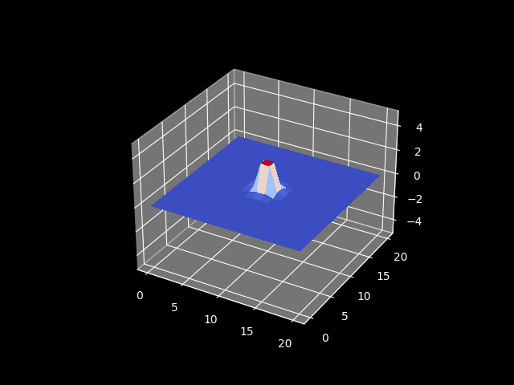

# Computational-Physics-Projects
In this repository I share my codes and notes related to physics simulations and complex calculations.

---

## Collapse scalar field
Simulate the dynamics of collapse scalar field based on this article: "Gravitational collapse of k-essence"
-  I perfomr a code in C, optmized with CUDA, the numerical methods are explicit euler method for the evolution, diference fintie for the derivate, the triagonal method for the Lapso and the integrals used the Simpson's method.

-  the physical system has a metric tensor such that:
```math
 \begin{equation}
     ds^2=-N^2dr^2+(dr+\beta^rdt)^2+R^2d\Omega^2
 \end{equation}
```
<figure>
   
  <figcaption>Dynamics field, show the energy accumulate in the origin, this modify the space-time causing the lapse collapse (black hole)</figcaption>
</figure>

## Semi-classic collapse scalar field (Thesis).
I replicated the results of the article: "Gravitational collapse of quantum fields and Choptuik scaling", also i implemet a modify the absorbing boundary conditions.
- The system consist in a massless scalar field with a quantum correction using coherent states in a spherically symmetric space-time, also employ Pauli–Villars regularization with five regulator fields and cosmological constant to handle the inherent divergences in the theory.
```math
 \begin{equation}
     ds^2=-\alpha^2dr^2+Adr^2+Br^2d\Omega^2
 \end{equation}
```
- The boundary condition be modify for absorb the normal modes, the tipical ABC correspond for a analict solutions for the wave equations and Klein-Gordon equations, but the Fourier solutions for a quantum field has linear combinations of incoming and outgoing waves. I porpussed a ABC than depend of mode k and mode l.
- The codes was wrote in C lenguage and optimized with CUDA, however the numerical methods are:
  - Implicit 10th Runge-Kutta, with the Gauss-Legendre cofficient, in the evolution equations.
  - 10th diference finite, for the derivate.
  -  4th Kreis-Oliger dissipation, artificial numeric
  -  And rectangular method, for the integrals.
<figure>
   
  <figcaption> (Left) Heatmap of the lapse, the color black indicate that the collapse toward a black hole, the semiclassic show the energy coming of the boundary, this by reason of the normal mode (quantum fields). (Rigth) each plots representing the energy-momentum tensor compontents with different numbers of normal mode, as this increases the components converges a vacuum values, this indicate a correct regularization with Pauli-Villars fields </figcaption>
</figure>

## Wave simulations with deep learning (PINN) 
I simulated the wave equations in cartesian coordinate using deep learning, the model for this is: "Physics-Informed Neural Network".
- This project i realized because explore the potential and efficient the PINN.
- The simulation was using '1000 epoch' for each step time. This model was very deficient and few exact in comparasion with tradicional methods.
- I know that I have a lot left to explore, both in terms of improving the model and studying the theory. I hope to better use artificial intelligence to solve differential equations in future projects. To do so, I need to study a lot of the underlying theory, identify physical systems where it can be implemented (and those where it can't), and stay up-to-date with the latest research.
<figure>
   
  <figcaption> Simulation of 2D wave equations using PINN </figcaption>
</figure>

## Jet in MHD simulation using PLUTO 
The last than i study is the framework PLUTO for the simulations the HD, MHD, RMHD, etc... how project i realized the little investigation of jets under magnetig field in cilindircal cordinate.
- PLUTO is a framework for simulate fluid orient for Astrophysical GasDynamics, is developed at the Dipartimento di Fisica, Torino University in a joint collaboration with INAF, Osservatorio Astronomico di Torino and currently under the support of the  SPACE Center of Excellence. (https://plutocode.ph.unito.it/)
- 
## Others
- Software for wave simulations.  
- N-body gravitational simulations, using leap-frog and particle-mesh methods.
- Project data science for the pm2.5 prediction.
